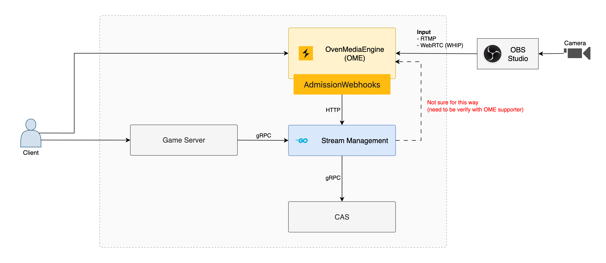
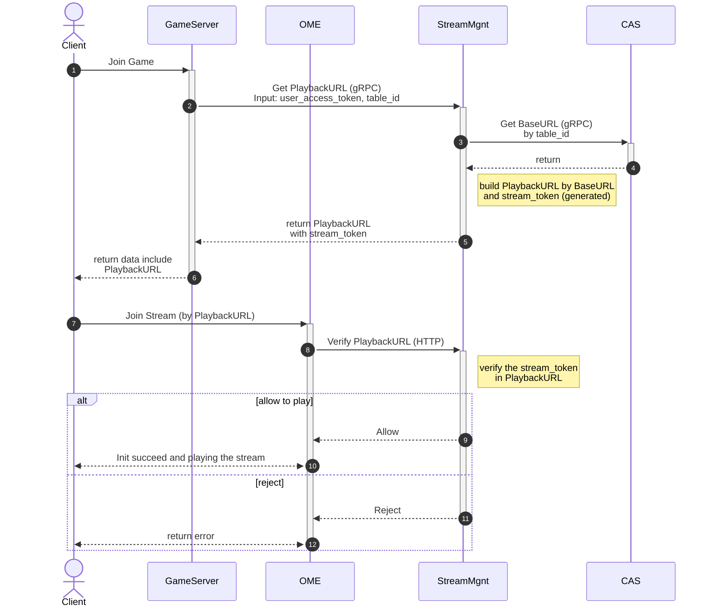
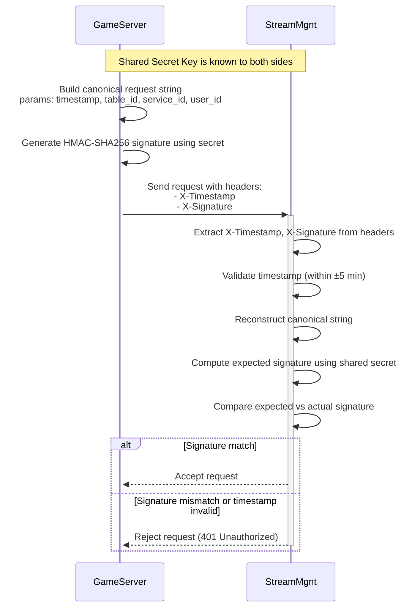

# Stream Management

A gRPC-based stream management service that handles authentication and authorization for live streaming sessions with OvenMediaEngine (OME).

## I. Overview



The Stream Management service acts as a middleware between game servers and OvenMediaEngine, providing secure stream access control through JWT tokens and OAuth 1.0a authentication. It manages playback URL generation, stream token verification, and admission control for live streaming sessions.

### Key Features

- **Stream Token Management**: Generate and verify JWT-based stream tokens
- **OAuth 1.0a Authentication**: Secure service-to-service communication with HMAC-SHA256 signatures
- **Admission Control**: Webhook-based access control for streaming clients
- **CAS Integration**: Dynamic base URL resolution through Central Access Service
- **gRPC & HTTP APIs**: Dual protocol support for different client needs

### Technology Stack

- **Language**: Go 1.24.5
- **Protocols**: gRPC, HTTP/REST
- **Authentication**: JWT, OAuth 1.0a (HMAC-SHA256)
- **Configuration**: YAML-based configuration
- **Logging**: Structured logging with Zap

## II. Flows

### 1. Join Stream

This flow demonstrates how a client joins a live stream through the game server, with secure token-based authentication.



### 2. Authentication between GameServer and StreamMgnt (OAuth 1.0a)

This flow shows the secure authentication mechanism between the game server and stream management service using OAuth 1.0a with HMAC-SHA256 signatures.



## III. API Reference

### gRPC Services

#### Management Service
- **GetPlaybackUrl**: Generate a secure playback URL with embedded stream token
- **ExtendStreamToken**: Extend the lifetime of an existing stream token (TODO)
- **RevokeStreamToken**: Revoke a stream token before expiration (TODO)

#### Health Service
- **GetStatus**: Check service health and readiness

### HTTP Webhooks

#### Admission Webhook
- **POST /v1/admission**: Validate stream access requests from OME
  - Verifies stream tokens in playback URLs
  - Returns admission decision (allow/reject)
  - Supports connection lifetime management

## IV. Configuration

The service is configured via `configs/config.yaml`:

```yaml
grpc_listener:
  tcp:
    address: 0.0.0.0
    port: 8080
    secure: false

http_listener:
  tcp:
    address: 0.0.0.0
    port: 8081
    secure: false

authorization:
  enabled: true
  secret_key: your-secret-key

stream_token:
  enabled: true
  jwt_signing:
    private_key: your-private-key
    issuer: stream_management
    default_audience: my_ome
    expires_time: 120000 # 2 minutes in milliseconds

cas_table:
  enabled: false
  socket:
    address: localhost
    port: 8080
  noop_default_playback_url: ws://localhost:3333/app/baccarat
```

## V. Development

### Prerequisites

- Go 1.24.5+
- Protocol Buffers compiler
- Buf CLI (for protocol buffer management)

### Docker Compose Demo

Follow these steps to run a complete streaming demo:

#### Step 1: Run Stream Management

```bash
# Start stream_management service
make up stream_management build=true
```

**Health Check:**

HTTP:
```bash
curl --location 'http://localhost:8081/v1/health/status?name=Lucas%20HTTP' \
--data ''
```

gRPC:
```bash
grpcurl -insecure \
  -d '{"name":"Lucas GRPC"}' \
  localhost:8080 \
  vortex.stream_management.health.Health/GetStatus
```

#### Step 2: Run OME Origin

```bash
# Start OME Origin server (configured in docker-compose.yaml)
make up ome_origin
```

**Configuration Check:**

Verify the Admission Webhooks configuration in `./configs/ome/OMEOriginServer.xml`:

```xml
<AdmissionWebhooks>
    <ControlServerUrl>http://stream_management:8081/v1/admission</ControlServerUrl>
    <SecretKey>1234</SecretKey>
    <Timeout>3000</Timeout>
    <Enables>
        <Providers>rtmp,webrtc,srt</Providers>
        <Publishers>webrtc,llhls,thumbnail,srt</Publishers>
    </Enables>
</AdmissionWebhooks>
```

This configuration ensures OME Origin will validate stream access through the Stream Management service.

#### Step 3: Demo

1. **Start Streaming with OBS:**
   - Configure OBS to stream to: `rtmp://localhost:1935/app`
   - Set streamKey: `baccarat`

2. **Generate Playback URL:**
   
   This demo only requires 2 services (OME and Stream Management), so we don't need to call the CAS Table service. Configure `configs/config.yaml` as follows:

   ```yaml
   cas_table:
     enabled: false
     socket:
       address: localhost
       port: 8080
     noop_default_playback_url: ws://localhost:3333/app/baccarat
   ```

   The base playback URL uses `noop_default_playback_url` from config. To generate a complete playback URL with stream token, follow these 2 steps:

   **Step 2a: Generate signature and timestamp**
   ```bash
   go run ./scripts/auth/main.go
   ```

   **Step 2b: Call Management service to get playback URL**
   ```bash
   grpcurl -insecure \
     -d '{
       "table_id": "baccarat",
       "service_id": "demo_service",
       "user_id": "demo_user",
       "authorization": {
         "signature": "<signature_from_step_2a>",
         "timestamp": <timestamp_from_step_2a>
       }
     }' \
     localhost:8080 \
     vortech.stream_management.management.Management/GetPlaybackUrl
   ```

   This will return a playback URL in format:
   ```
   ws://localhost:3333/app/baccarat?stream_token=xxx
   ```

3. **View the Stream:**
   - Open [demo.ovenplayer.com](https://demo.ovenplayer.com)
   - Use the generated playback URL to view the live stream

## VII. Security Considerations

### Stream Token Security
- JWT tokens are signed with RS256 algorithm
- Default token lifetime is 2 minutes (configurable)
- Tokens include audience validation for OME instances

### Service Authentication
- OAuth 1.0a with HMAC-SHA256 signatures
- Timestamp validation prevents replay attacks (±5 minute window)
- Secret keys should be stored in secure key management systems

### Network Security
- TLS encryption supported for both gRPC and HTTP endpoints
- IP-based access control through admission webhooks
- Request validation using Protocol Buffer constraints


